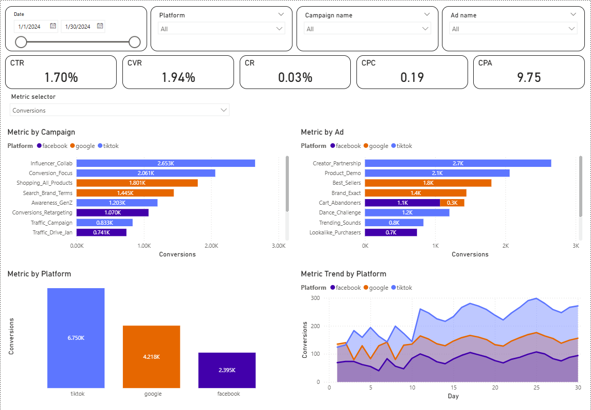

# Performance Marketing Dashboard

Tools: Power BI, DAX

Dataset is based on anonymized real-world paid media performance data across Google, Facebook, and TikTok.

📊 [Dashboard](Campaign%20Performance%20Dashboard.pbix)
📂 [Dataset](dataset.csv)

## What This Project Demonstrates

- Marketing performance analysis
- KPI-driven dashboard design
- Business-oriented data storytelling
- Power BI data modeling and DAX skills
  
## Business Context

The goal was to:
- Track marketing efficiency (CPA, ROAS)
- Identify top-performing campaigns and ads
- Analyze conversion trends by platform
- Support budget reallocation decisions

## Metrics

- Clicks, Conversions
- Likes, Shares, Comments
- CTR, CPC
- CVR, CPA, CR
- ROAS, RPC
- CPM, Frequency
- Engagement Rate
- Video View Rates (25%, 50%, 75%, 100%)
- Quality Score, Search Impression Share

## Dashboard Structure

1. KPI overview section — high-level performance metrics
2. Campaign breakdown — top campaigns by selected metric
3. Ad-level performance — granular efficiency analysis
4. Trend analysis — daily performance trends by platform
5. Dynamic metric selector to switch between metrics

## Key Insights

- Google drives the highest revenue efficiency and conversion performance.
- Facebook retargeting delivers the lowest CPA.
- TikTok generates strong traffic volume but weaker conversion efficiency.
- Budget reallocation toward high-intent and retargeting campaigns is recommended.

## Identified Cases

- **Google – Search_Generic_Terms**: highest CPA and lowest quality metrics despite the largest budget allocation.
- **Facebook – Video_Views_Campaign**: strong video engagement but weak CTR and CR, indicating pre-click creative mismatch.
- **TikTok – Conversion_Focus**: strong conversion rates but low engagement metrics, suggesting creative optimization potential.
